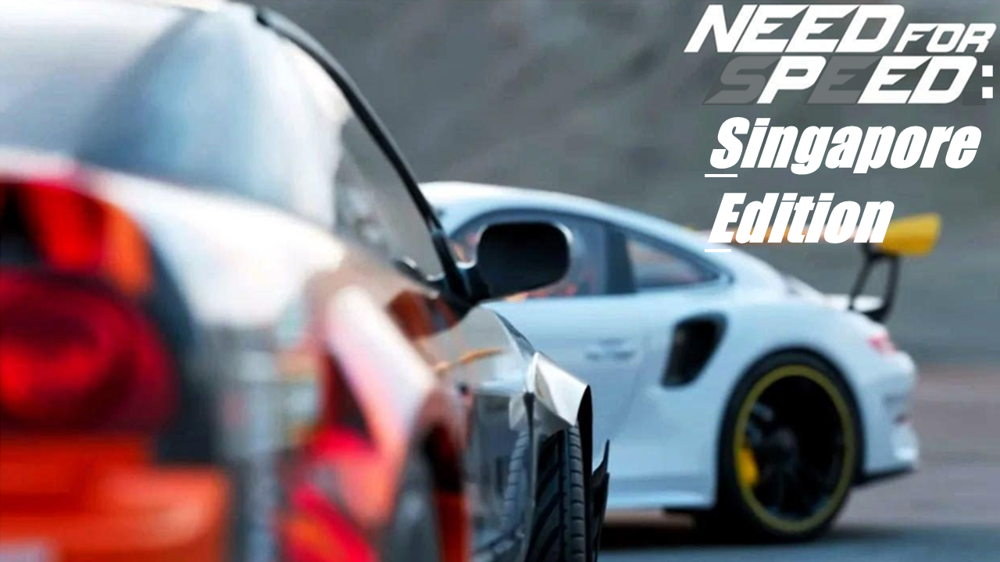
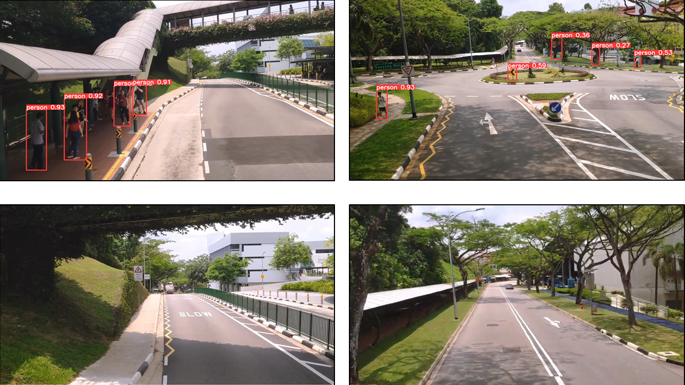
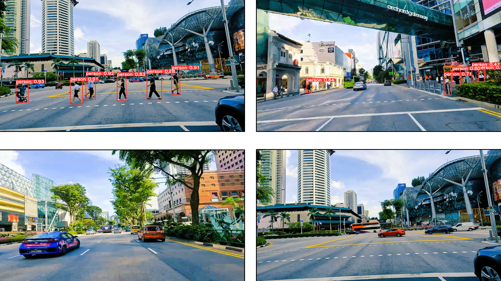
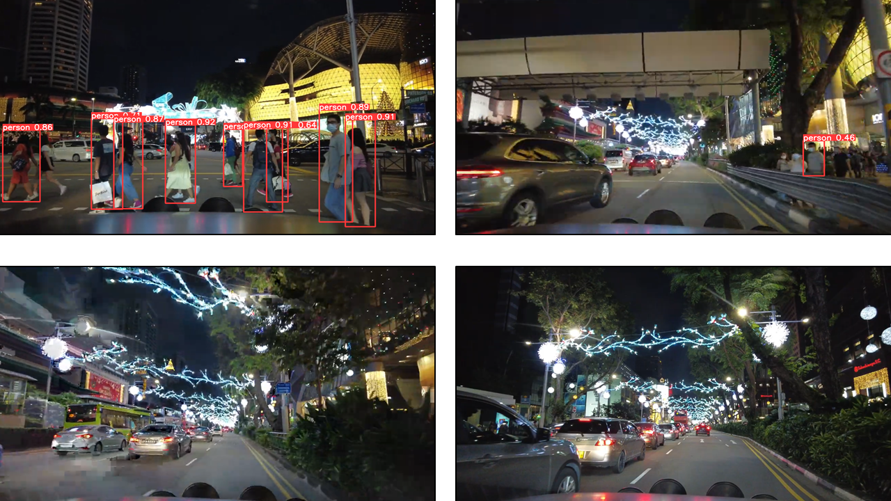

### Contents
- [Problem Statement](#problemstatement)
- [Data Collection](#datacollection)
- [Executive Summary](#executivesummary)
- [Model Evaluation (Image Classification)](#modelevaluationic)
- [Model Evaluation (Object Detection)](#modelevaluationod)
- [Conclusion](#conclusion)

***
<div id="problemstatement"></div>

## Problem Statement

Autonomous vehicles are gaining traction in Singapore. Complementing the primary R&D function on AI/Big Data, autonomous vehicles and urban air mobility etc., the upcoming Hyundai's Electric-Vehicle (EV) Plant in Jurong Innovation District is projected to produce 30,000 cars by 2025. Since the arrival of Tesla in Singapore in Jul 2021, the exponential growth in popularity of the "Apple-like" automobile brand in Singapore is arguably biggest testimony to the direction smart vehicles are steered towards in the near future.  

At present, as the members of the data science group for the Centre of Excellence for Testing & Research of Autonomous Vehicles - NTU (CETRAN), the team has been assigned with the following two-prong task aimed at identifying pedestrians in urban environments:  
(i) Develop an image classification model to determine whether there are pedestrian(s) in a given image; and  
(ii) Develop an object detection model to identify and spatially indicate pedestrian(s) in a given image or video, if any. 

The model should be sufficiently adaptable to operate under both day and night conditions. The results will guide the implementation of anti-collision technologies as part of CETRAN's autonomous vehicle testing. Scoring benchmarks set for primary metrics (accuracy, loss, mAP) and secondary metrics (sensitivity, F1-score) are 90% and 80% respectively.  

<div id="datacollection"></div>

## Data Collection

Data sources include:  
a) Kaggle Pedestrian Dataset - Images contain person and person-like (e.g. statues, mannequins, scarecrows and robots) objects, conveniently split into train (944 images), validation (160 images) and test (235 images) sets. This will mainly be used for model training.  
b) Recorded Videos/images - Videos of two locations in Singapore (NTU, Orchard Road) are extracted from YouTube and will serve as 'holdout data'. Generally, the videos (each 2-4mins) are split according to location and day/night. 


<div id="executivesummary"></div>

## Executive Summary

After loading in the datasets, EDA was first performed which included verifying class labels, checking class imbalance and plotting image dimensions. Through EDA, it was discovered that selected images were wrongly labelled. Hence, data cleaning was manually performed at the backend image by image. After which, the images were resorted into 'Person' and 'Non-Person' folders as part of pre-processing, which enables the images to be loaded via Keras' ImageDataGenerator at the modelling stage.  

Next, data visualization was carried out using a popular albeit traditional Computer Vision method known as the Histogram of Oriented Gradients (HOG) + Support Vector Machine. The HOG algorithm performed poorly as it not only missed out on multiple actual persons (low True Positive and high False Negative) but falsely classified many other parts/elements in the image as persons (high False Positive). Perhaps, it is unsurprising given that the HOG model is over 15-years old at the time of writing. Nonetheless, it provides a spatial sense of the project's end goal of developing an object detection model for pedestrians.  

<div id="modelevaluationic"></div>

## Model Evaluation (Image Classification)

For image classification modelling, building a convolutional neural network (including tuning and regularization) from scratch was first attempted before exploring pre-built models (VGG16, ResNet50) via transfer learning.  

||Test Accuracy Score|Loss (Binary Crossentropy)|Recall|F1-score|
|---|---|---|---|---|
|**Base (CNN)**|0.7191|0.7338|0.8526|0.8012|
|**Base + Additional Hidden Layers**|0.7404|0.7660|0.8590|0.8146|
|**Base + Additional Hidden Layers + Additional Convolutional Stack**|0.6681|1.2009|0.7628|0.7532|
|**Base + Additional Hidden Layers + Regularization (L2)**|0.7149|1.3948|0.9679|0.8184|
|**Base + Additional Hidden Layers + Regularization (Dropout)**|0.6979|1.0983|0.8269|0.7842|
|**Base + Additional Hidden Layers + Regularization (Early Stopping)**|0.7234|0.6150|0.8526|0.8036|
|**VGG16**|0.8170|0.4634|0.8590|0.8617|
|**ResNet50**|0.7191|0.6032|0.7115|0.7708|

Comparing the scoring metrices, none of the models achieved the established test accuracy score of 90%, which was identified as a primary indicator of model performance. From observation, the training accuracy scores across all models were able to reach (close to) 100% after a certain number of epochs while the corresponding test accuracy score fails to surpass the ~80%+ mark, signalling to a case of overfitting. Data augmentation (via Keras' ImageDataGenerator) and stopping training early did not improve the model performance, suggesting the need for an even larger training set. Conversely, the sensitivity (i.e. recall) scores fared much better with all models (except two) meeting the established threshold of 80%, which means that false negatives are minimized. In a similar vein, the F1-scores returned were largely acceptable; about half the models complied with the benchmark of 80% and for models that did not, the figures did not deviate too significantly. By and large, tuning/regularization did not improve model performance.    

Taking all metrics into consideration, the best performing model was the VGG16 model as it not only had the highest test accuracy score and F1-score, but minimized the loss function the most as well, although the recall score was average. Thus, the VGG16 model will form the final production model (see notebook for detailed model summary). Applying the production model to 12 sample frames from recorded videos with the objective of identifying pedestrian(s), the model only predicted 6 images (50%) correctly, alluding to further enhancements required.  

<div id="modelevaluationod"></div>

## Model Evaluation (Object Detection)

For object classification modelling, two pre-built models founded on the 'You Only Look Once' architecture were explored, namely the Darknet + YOLOv4 and PyTorch + YOLOv5 models. However, the former (deployed locally via GPU (NVIDIA GeForce GTX1080) with OpenCV 4.5.5, CUDA 11.6 and CUDNN 8.3.2) was mainly intended as an experiment for a 'state-of-the-art' object detection model, and only the latter (deployed via Google Colab) was trained on the custom pedestrian dataset.  

Summarizing the PyTorch+YOLOv5 model performance:  

|Precision|Recall|mAP @ IoU = 0.5|
|---|---|---|
|0.924|0.815|0.879|

The subject model returned a highest mAP score of 0.879 on the test set, signalling to a competent model although it fell slightly short of the 90% criteria. By interpretation, at the IoU threshold of 0.5 (i.e. IoU >= 0.5: identified as person object (class 1); IoU < 0.5: identified as non-person object (class 0)), the average of the mean precisions across both classes is 0.879. This higher average precision is translated to the model having a high level of accuracy in predicting actual positives (True Positives). 

Results of the PyTorch+YOLOv5 model on the recorded video frames printed below for ease of reference:  







The PyTorch + YOLOv5 model performed commendably for pedestrian detection in various urban backdrops and alternating day/night conditions; the model was not only able to detect person objects but with high confidence too. 

<div id="conclusion"></div>

## Conclusion

In sum, while the production models did not meet the established threshold of 90% for the primary scoring metrics (i.e. test accuracy, mAP), the performance only fell short by a small margin. Thus, the production models form a solid basis for further refinements. Given that the models results will guide the implementation of anti-collision technologies in autonomous vehicle, it is imperative to achieve an extremely high predictive power with close-to-zero margin of error. Three areas for improvement are highlighted:  

- Datasets - Use a larger dataset with more varied images of person objects to enhance model training, which would help to reduce the degree of overfitting and improve performance on a wider range of unseen images containing pedestrians.  
- Models - Conduct additional research on the underlying mechanisms of the models trained (i.e. "black box") to better understand how the production models classify/detect objects. Possible factors may include object shape, colour and form, as well as the constituent parts which defines an object (i.e. one head, two hands, two legs = person).  
- Ensembling - Augment model performance by implementing ensembling techniques to form a 'committee of networks', which not only allows for better tuning/regularization but a robust model with more optimized bias-variance tradeoff too.  

Lastly, after an acceptable image classification and object detection for pedestrian identification have been developed, more road (e.g. different vehicle types) and roadside elements (e.g. traffic signs, traffic lights etc.) may be incorporated into the models as additional classes, which would enable 'smarter' vehicles in terms of more intelligent responses to ever-changing road conditions. 

```python

```
