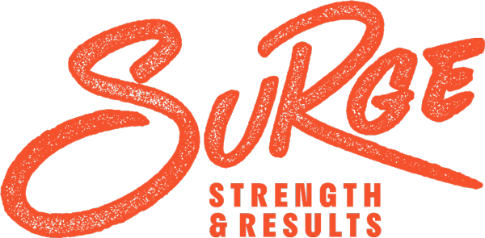

# Project FitNut - Classification Modelling via Natural Language Processing

([*Source*](https://surgesr.com/wp-content/uploads/2021/09/surge-new-logo.png))

### Contents
- [Problem Statement](#problemstatement)
- [Executive Summary](#executivesummary)
- [Model Evaluation](#modelevaluation)
- [Recommendations](#recommendations)

***

## Problem Statement

Covid-19 has accelerated the digital transformation journey of traditional brick-and-mortar businesses on a global scale. SURGE - an elite private gym concept under the Core Collective group specializing in curated fitness/wellness programmes - is exploring a new business unit that focuesses on a tailored dual fitness-and-nutrition concept. Before doing so, SURGE plans to study latest trends and grasp ground sentiments on fitness/nutrition through analyzing two relevant subreddit threads: [*r/bodyweightfitness*](https://www.reddit.com/r/bodyweightfitness/) and [*r/EatCheapAndHealthy*](https://www.reddit.com/r/EatCheapAndHealthy/). 2,000 posts were arbitrarily downloaded from bodyweightfitness and EatCheapAndHealthy subreddits. As the hired Data Science consultant, develop a classification model to determine which of the abovementioned subreddits a given thread originates from. The scoring benchmark is set at 90%, which seeks to provide a balance between reducing classification erors and ensuring that the production model is not overfitted. The main scoring metrices considered are accuracy, F1-score and ROC AUC score. 

## Executive Summary

First, Pushshift API is utilized to collect the latest 1,000 posts from bodyweightfitness and EatCheapAndHealthy subreddits respectively; only the title, selftext and subreddit were extracted. After which, both datasets were consolidated into a single dataframe. 

Second, data cleaning was performed which included dropping duplicates, replacing invalid inputs, imputing missing values with empty strings, checking for repetition, creating a new 'text' column (title + selftext) to serve as the predictor feature, remove URLs from 'text' column, and mapping 0/1 to both subreddits for ease of identification. 

Third, EDA was separately carried out for bodyweightfitness and EatCheapAndHealthy posts, mainly comparative summary statistics and  unigram/bigram analysis. Tokens were also visualized using wordcloud to provide a different perspective. To enhance NLP, CountVectorizer was applied to the dataset prior to EDA. For bodyweightfitness posts, bigrams (e.g. 'pull up', 'push up', 'body weight') were by far more meaningful whereas for EatCheapAndHealthy posts, unigrams (e.g. 'eat', 'food', 'healthy') were adequately telling. Admittedly, more words/phrases related to the body (e.g. "lean", "shape") were expected as it was supposed to be the parallel trait between fitness and nutrition. 

For the modelling stage, four model types (Logistic Regression, KKNeighborsClassifier, Multinomial Naive Bayes and Random Forest) were considered in total. The intention was to ensure an encompassing production modelling process by evaluating model types with varying mechanism in ascertaining the optimal. For all models, the TfidfVectorizer was applied to transform words/texts into meaningful representations of numbers for further analysis. The TfidVectorizer arguments (i.e. max features, stop words, ngram range) were kept constant to maintain consistency between model comparisons. 

## Model Evaluation

Table summarizing relative model performance:  

||Train Accuracy Score|Test Accuracy Score|F1 Score|ROC AUC Score|
|---|---|---|---|---|
|**Logistic Regression**|0.9301|0.9231|0.9246|0.9738|
|**KNeighborsClassifier**|0.7936|0.5333|0.6818|0.6645|
|**Multinomial Naive Bayes**|0.9244|0.9077|0.9058|0.9804|
|**Random Forest**|0.8962|0.9000|0.9051|0.9665|

Comparing the scoring metrices, the three probabilistic models (Logistic Regression, Multinomial Naive Bayes, Random Forest) had similar performances with accuracy, F1 and ROC AUC scores at 90% or above, which met the 90% benchmark set. In contrast, the KNeighborsClassifier model paled in comparison significantly, with scores in the range of 50% to 70%. This shows that building the binary classification model using distance logic for prediction is not advisable, likely due to a weak spatial relationship between observations. The large difference between the train accuracy score (80%) and test accuracy score (~50%) showed that the KNeighborsClassifier model was severely overfitted.

Of the three remaining models, the Logistic Regression model was selected as the final production model since it returned the highest scores for accuracy and F1 score, and the ROC AUC score was only slightly lower (<1%). The parameters for the production model are as follow: 
- Model type: **Logistic Regression**
- Max number of features: 2,500
- Stop words used: English
- Best NGram: Unigram
- LogReg Penalty: Ridge
- LogReg Penalty Strength: Minimal

Based on the test accuracy score for the production model, the model would be able to classify a given post correctly ~92% of the time. The high F1-score of ~92% illustrates an optimal equilibrium achieved in the precision-recall tradeoff; the model not only achieves a high percentage in determining the number of true positives over the total positives in the dataset, but with high confidence as well. Lastly, the high ROC AUC score of ~97% indicates that the model effectively minimizes false positives and false negatives, and has strong ability to distinguish between both binary classes (i.e. bodyweightfitness and EatCheapAndHealthy subreddits).

## Recommendations

In conclusion, the primary objective of developing a binary classification model with a scoring benchmark of 90% was achieved. To further improve the model, a more diverse range of model types may be trained/tested, and (hyper)parameters further tuned. Additionally, related subreddits may also be considered to provide extra training data for the model, which would likely enhance classification results. SURGE may confidently adopt the chosen production model for the fitness and nutrition teams to predict parent subreddits, where the teams handling the portfolios may assess the posts subsequently. Lastly, it is also promising to note that the sentiments for both forums are generally positive, and conclusions drawn from the posts will likely be indicative of prevailing and upcoming trends for both domains.
