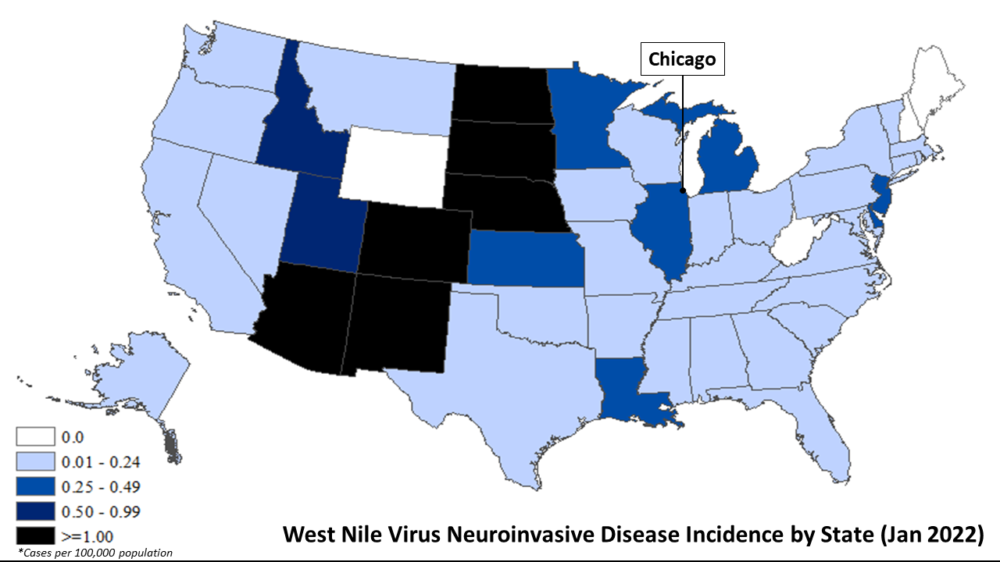

# West the Mozzies Nile? 

### Contents
- [Problem Statement](#problemstatement)
- [Executive Summary](#executivesummary)
- [Data Dictionary](#datadictionary)
- [Model Evaluation](#modelevaluation)
- [Cost-Benefit Analysis](#cba)
- [Conclusion](#conclusion)

***
<div id="problemstatement"></div>

## Problem Statement



*West Nile Virus Incidence by US State* ([*source*](https://www.cdc.gov/westnile/statsmaps/preliminarymapsdata2021/incidencestate-2021.html))

West Nile Virus (hereafter "WNV") is the leading cause of mosquito-borne disease in continental United States ([*source*](https://www.cdc.gov/westnile/index.html#:~:text=West%20Nile%20virus%20(WNV)%20is,summer%20and%20continues%20through%20fall.)). In 2021, there were a total of 61 reported WNV cases and 3 associated deaths in Illinois, a sizable proportion of which was in Chicago ([*source*](https://www.cdc.gov/westnile/statsmaps/preliminarymapsdata2021/disease-cases-state-2021.html)). As members of the recently formed (fictitious) Disease And Treatment Agency, division of Societal Cures In Epidemiology and New Creative Engineering (DATA-SCIENCE) research team under The University of Chicago, the Chicago Municipal Government Department of Public Health has engaged the team to develop a prediction model to identify the *spatial* and *temporal* elements of WNV. Specifically, the model should not only unearth areas in Chicago that are vulnerable to WNV but shed light on when cases are expected to escalate. The results will guide the state's effort in combating WNV through the deployment of pesticides. The scoring benchmark is set at 80% for the evaluation metrics considered, namely accuracy, ROC-AUC score, sensitivity and F1-score. 

<div id="executivesummary"></div>

## Executive Summary

First, data cleaning was performed for all the datasets (i.e. train, test, weather, spray). This included mapping species to numerical values, aggregating the number of mosquito count, treating duplicate observations, dropping selected climatic variables, imputing missing values for climatic variables, and dropping the Time column for the spray dataset. 

Second, feature engineering was conducted to create a relative Humidity variable using temperature and dew point, and Date was converted to datetime and split into Dayofmonth, Month and Year. Also, taking the life cycle of Culex species mosquitoes into account where it takes approximately 7 to 10 days for an egg to develop into an adult mosquito into account, a 10-day rolling was implemented accordingly. 

Third, EDA was performed to check for possible relationships between weather conditions and date factors (e.g. month) and presence of WNV. The areas with presence of WNV were mapped out to identify areas which had higher prevalence of WNV.

For the modelling stage, seven model types (Logistic Regression, KKNeighborsClassifier, Random Forest, Extra Trees, AdaBoost, Gradient Boost, XGBoost) were considered in total. The intention was to ensure an encompassing production modelling process by evaluating model types with varying mechanism in ascertaining the optimal. Multiple iterations of modifying predictor features and gridsearch were carried out to ensure that the best hyperparameters were selected. 

<div id="datadictionary"></div>

## Data Dictionary

The data dictionary for the predictor features in the production model is as follows: 

|Feature|Type|Origin|Description|
|---|---|---|---|
|**latitude**|*float*|train.csv|Geographic coordinate taken from north south of the equater|
|**longitude**|*float*|train.csv|Geographic coordinate taken from east or west of the prime meridian|
|**dayofmonth**|*datetime*|engineered feature|The day of the month represented by a numerical value. The range of possible values is 1 (first day of month) to 31 (last day of month)| 
|**month**|*datetime*|engineered feature|The month in a year represented by a numerical value. The range of possible values is 1 (January) to 12 (December)|
|**year**|*datetime*|engineered feature|The year which observations were recorded. The values correspond with the time period for the study (2007, 2009, 2011, 2013)|
|**tavg**|*float*|weather.csv|Average ambient temperature at a given point in time/location recorded in degrees farenheit|
|**dewpoint**|*float*|weather.csv|Dew point temperature at a given point in time/location recorded in degrees farenheit|
|**preciptotal**|*float*|weather.csv|Depth of precipitation at a given point in time/location recorded in inches|
|**sealevel**|*float*|weather.csv|Average sea level pressure at a given point in time/location recorded in inches of Hg (mercury)|
|**avgspeed**|*float*|weather.csv|Wind speed at a given point in time/location recorded in miles per hour|
|**humidity**|*float*|engineered feature|Relative humidity at a given point in time/location derived by August–Roche–Magnus formula|
|**species_encode**|*int*|engineered feature|Identifier for mosquito type derived by one-hot encoding Species column. Divided into non-WNV carrier (0) vs. WNV carrier (1, 2, 3) values|
|**trap**|*int*|engineered feature|Identifier for mosquito traps derived by one-hot encoding Trap column. Divided based on original trap index (T002 to T903; not all numbers inclusive)|

<div id="modelevaluation"></div>

## Model Evaluation

Table summarizing relative model performance:  

| model | GridSearch_score | train_score | validation_score | accuracy_valid | recall_valid | roc_auc_score | f1score_test |
|---|---|---|---|---|---|---|---|
|**Logistic Regression**|0.7302|0.7823|0.7884|0.8931|0.1758|0.5545|0.1481|
|**KNeighborsClassifier**|0.8013|0.8713|0.8256|0.6574|0.8901|0.7672|0.2154|
|**Random Forest**|0.8130|0.8752|0.8709|0.7677|0.8352|0.7996|0.2754|
|**Extra Trees**|0.7917|0.9016|0.8544|0.8264|0.7143|0.7735|0.3030|
|**AdaBoost**|0.8031|0.8131|0.8563|0.6754|0.8681|0.7664|0.2204|
|**Gradient Boost**|0.8056|0.8378|0.8642|0.7195|0.8352|0.7741|0.2394|
|**XGBoost**|0.8106|0.8702|0.8671|0.7828|0.7912|0.7868|0.2780|

The scoring metrics that we are taking into consideration are the `Accuracy`, `Sensitivity` and `ROC AUC Score`. The reason why `Sensitivity` is selected is due to the fact that False Negatives, or cases when there is the presence of West Nile Virus but predicted as none, are more dangerous and as such there is a need to reduce them.

The Random Forest model was selected as the final production model, as it has the highest ROC AUC Score of 0.7996 and a relatively high accuracy score on the validation set (0.7677) and a high recall score on the validation set (0.8352). 

The parameters for the production model are as follow: 
- Model type: **Random Forest**
- Class Weight: Balanced Sample  
- Max Depth: 10
- Max Features: Auto
- Min Samples Leaf: 5
- N Estimators: 200

With the exception of sensitivity, the production model falls slightly short of the established scoring benchmark of 80%, largely due to the narrow scope of predictor features (primarily climatic variables) made available for assessment. Particularly, the low F1-score of 0.2754 is attributed to the low precision arising from the model weakness to address false positives. 

<div id="cba"></div>

## Cost-Benefit Analysis

Analyzing both costs (spraying agent, manpower, transport, operational costs etc.) and benefits (potential savings for medical treatment fees saved, potential loss of GDP avoided etc.) collectively, the **annual net cost/benefit = (USD41,110 + USD70,382) - (USD4,400,000 + USD235,000) = -USD4,523,518**. While only a handful of factors were considered and multiple underlying assumptions were made for the sake of calculation, the results nonetheless show that the costs of spraying heavily outweigh the benefits. Hence, adopting a blanket approach in spraying all predicted WNV areas is not advisable. This is in part attributed to the weaker-than-desired production model perforamnce. Rather, the following recommendations are put forth: 

a) Instead of spraying all predicted WNV areas, a more targetted approach may be taken by only spraying areas with repeated WNV incidences over the years. With reference to the folium heatmap above, these locations include:  
- Norridge/Elmwood Park - Suburb-styled residential areas in the northern part of Chicago  
- Lower West Side/McKinley Park - Southern periphery of the main CBD area with some apartment-styled buildings  
- Calumet Heights/Riverdale/Beverly - Mainly suburb-styled residential areas near industrial developments in southern part of Chicago  

b) Building on the preceding point, more context-specific studies may be carried out on areas with persistent WNV occurences. Possible relationships may be established between certain types of land uses and WNV rates. Using Norridge/Elmwood Park as an example, the presence of an adjacent nature reserve (Schiller Woods) may prove conducive breeding grounds for mosquitoes and hence, result in more WNV cases observed in surrounding neighbourhoods. Similarly for Riverdale, the neighbourhood might experience higher WNV rates as it is in close proximity to the Calumet Water Reclamation Plant, where conditions are favourable for moquitoe breeding.  

c) Additionally, the DATA-SCIENCE research team should identify more predictor variables to ensure robustness and comprehensiveness of the production model. At present, only climatic variables (e.g. temperature, precipitation, humidity, wind speed) are considered in the model. In reality, there are other contributing factors, which encompasses but is not limited to the built environment, biodiversity ecosystems and human behaviour.   

d) Lastly, part of the funds may be allocated to educating the masses as human actions have a direct impact on the mosquitoe growth rate. 

<div id="conclusion"></div>

## Conclusion

Based on the study findings, WNV will likely escalate during summer months where temperature, precipitation and relative humidity are higher, in the i) northern residential neighbourhoods, ii) southern periphery of the CBD area, and iii) residential areas near industrial sites in the southern region of Chicago. 


```python

```
